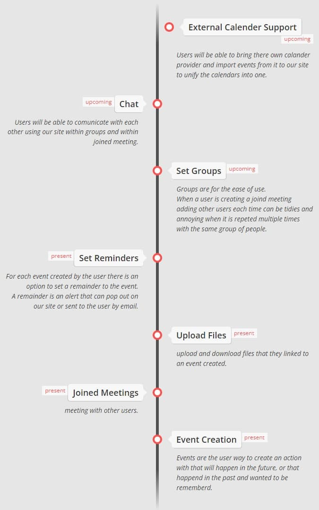
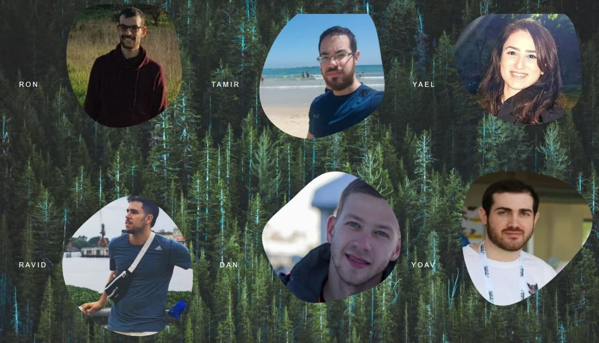

# Description

```md
'Lets-Meet' is an open-source platform that is meant to be used by everyone.
The platform is meant to help the users to manage meetings of different types
and centralize related information that links to those meetings such as files.
```

# Motivation

```md
There is difficulty coordinating meetings between different people,
whether it’s a meeting between teammates, meeting between a few students, 
catching up with friends or family and more, due to a busy schedule
that varies from person to person.
Therefore, to solve this problem, we would like to develop “Lets Meet”.
```

# Features Road Map



# Architecture

| Frontend      | Backennd      | Database      |
| ------------- | ------------- | ------------- |
| HTML          | Python        | SQLite        |
| CSS           | Django        |
| JavaScript    | Vagrant       |
| Bootstarp     |
| React         |

# Getting started

Download and run the project locally.

## Pre-Requirements

### Steps

1. install [Vagrant](https://www.vagrantup.com/) and [VirtualBox](https://www.virtualbox.org/) hypervisor(VMM)

- We suggest reading about those before using them

2. Clone [LetsMeet](https://github.com/redhat-beyond/lets-meet) repository to the desired path.
  ``` git clone https://github.com/redhat-beyond/lets-meet.git ```

3. Navigate via terminal to the cloned directory.

4. run `vagrant up`  ( `vagrant halt` to stop later when desired. )

5. open the browser and click the [link](https://localhost:8000), or type `localhost:8000`

# Team members & github links

- [Ron](https://github.com/RonHachmon)
- [Tamir](https://github.com/MortarDefender)
- [Yael](https://github.com/YaelD)
- [Ravid](https://github.com/RavidYael)
- [Dan](https://github.com/danninon)
- [Yoav](https://github.com/BelikovYoav)


